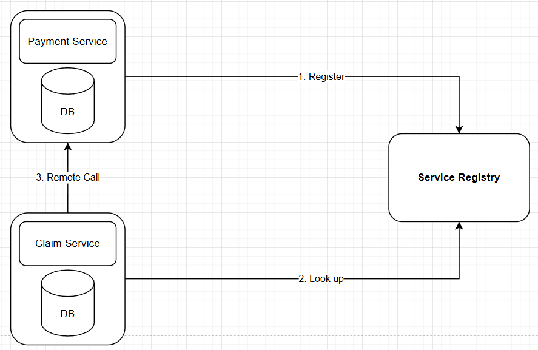
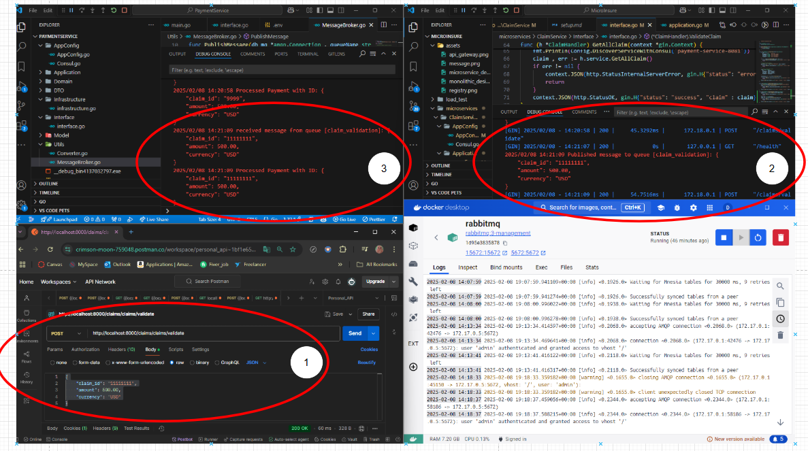

# Microservices Project and Kubernetes : MicroInsure

## Project Introduction: 

- MicroInsure is a Golang based microservices Insurance portal application, featuring a scalable distributed and high performance concurrentcy along with CI/CD implementation. Each services will have its own database system, along with Kafka or RabbitMQ for reliable message queue. 

## Tech used 
- Framework and Programming Language: Golang
- Tool and Testing: PostgreSQL, RedisCache, RabbitMQ, Kafka, API Gateway, K6 for load testing

### Sprint 1: Design Monolithic system and improved to Microservices - discuss their differences

#### Monolithic System - Code base under /monolithic
- A single unified codebase.
- All components are interconnected and interdependent.
- Easier to develop initially but harder to scale.
- Deployment involves the entire system.
- If one service have high load then other services will be impacted as well.


#### Microservices System - Code base under /microservices
- Composed of small, independent services.
- Each service can be developed, deployed, and scaled independently.
- More complex to develop initially but easier to scale and maintain.
- Deployment involves individual services.
- In case one services fail, the other services will not be down.
- If any service experience high load, other services will not be affected, meanwhile, we can set different resources for each services based on usage.


#### Differences
- **Scalability**: Monolithic systems are harder to scale, while microservices can be scaled independently.
- **Development**: Monolithic systems are easier to develop initially, whereas microservices require more effort.
- **Deployment**: Monolithic systems require full deployment, while microservices allow for independent deployment.
- **Maintenance**: Microservices are easier to maintain due to their modular nature, while monolithic systems can become complex over time.

### Sprint 2: Implement API Gateway and Service Registry

##### Running Services at local: 

| Services  | Port |
| ------------- | ------------- |
| Claim Service  | :8080  |
| Payment Service  | :8081  |
| Policy Service | :8082  |
| Claim DB/Cache  | :5432 / :6379  |
| Payment DB/Cache  | :5433 / :6380  |
| Policy DB/Cache  | :5434 / :6381  |

#### Result after Register services to Consul
http://localhost:8500/v1/agent/services
```bash
{
  "claim-service-8080": {
    "ID": "claim-service-8080",
    "Service": "claim-service",
    "Tags": [],
    "Meta": {

    },
    "Port": 8080,
    "Address": "127.0.0.1",
    "TaggedAddresses": {
      "lan_ipv4": {
        "Address": "127.0.0.1",
        "Port": 8080
      },
      "wan_ipv4": {
        "Address": "127.0.0.1",
        "Port": 8080
      }
    },
    "Weights": {
      "Passing": 1,
      "Warning": 1
    },
    "EnableTagOverride": false,
    "Datacenter": "dc1"
  },
  "payment-service-8081": {
    "ID": "payment-service-8081",
    "Service": "payment-service",
    "Tags": [],
    "Meta": {

    },
    "Port": 8081,
    "Address": "127.0.0.1",
    "TaggedAddresses": {
      "lan_ipv4": {
        "Address": "127.0.0.1",
        "Port": 8081
      },
      "wan_ipv4": {
        "Address": "127.0.0.1",
        "Port": 8081
      }
    },
    "Weights": {
      "Passing": 1,
      "Warning": 1
    },
    "EnableTagOverride": false,
    "Datacenter": "dc1"
  },
  "policy-service-8082": {
    "ID": "policy-service-8082",
    "Service": "claim-service",
    "Tags": [],
    "Meta": {

    },
    "Port": 8082,
    "Address": "127.0.0.1",
    "TaggedAddresses": {
      "lan_ipv4": {
        "Address": "127.0.0.1",
        "Port": 8082
      },
      "wan_ipv4": {
        "Address": "127.0.0.1",
        "Port": 8082
      }
    },
    "Weights": {
      "Passing": 1,
      "Warning": 1
    },
    "EnableTagOverride": false,
    "Datacenter": "dc1"
  }
}
```

#### Result after adding API Gateway 
| **Service Name**  | **API Gateway Path (Kong)** | **Backend Service Path** |
|-------------------|----------------------------|--------------------------|
| Claim Service    | `http://localhost:8000/claims` | `http://localhost:8080` |
| Payment Service  | `http://localhost:8000/payments` | `http://localhost:8081` |
| Policy Service   | `http://localhost:8000/policies` | `http://localhost:8082` |


- How the service registry work between multiple services


### Sprint 3: Decoupling problem 

#### Why Do We Need Decoupling Between Two Services?
Decoupling services allows systems to be **scalable, resilient, and maintainable** by reducing dependencies between components. In a **tightly coupled system**, one service directly depends on another, making failures or changes more disruptive. By introducing **decoupling**, services can **communicate asynchronously, handle failures gracefully, and scale independently**.

#### Key Benefits of Decoupling
- **Scalability**: Each service can scale independently based on its workload.
- **Fault Tolerance**: If one service fails, it does not bring down the entire system.
- **Maintainability**: Easier to modify, replace, or update services without affecting others.
- **Asynchronous Processing**: Improves performance by allowing tasks to be queued and processed later.
- **Better Resource Utilization**: Services can process tasks at their own speed, avoiding bottlenecks.

#### Example: Payment and Claim
Consider a scenario where 
- **Claim Service** (Handles customer claim)
- **Payment Service** (Processes payments)

#### Without Decoupling (Synchronous Request-Response)
- The **Claim Service** calls the **Payment Service** immediately.
- If the **Payment Service** is down, claim fail.
- The **Claim Service** is blocked, leading to poor performance and possibly data lost.

#### With Decoupling (Using a Message Queue)
- The **Claim Service** places a **payment request** in a **message queue**.
- The **Payment Service** picks up the request **asynchronously** and processes it.
- If the **Payment Service** is down, the request remains in the queue and is retried later.

**Result**: Claim are **not blocked**, failures are **handled**, and the system **scales better**.


**After Setup Message Broker** 


### **Conclusion**  

The transition from a **monolithic** to a **microservices** architecture in MicroInsure highlights the benefits of **scalability, fault tolerance, and modularity**. While microservices improve **independent service management and resilience**, they introduce operational complexities such as **service discovery, load balancing, and inter-service communication**.  

Currently, **API Gateway** , **message brokers (Kafka/RabbitMQ)** and **Service Registry** play a crucial role in **handling service requests and asynchronous communication**, ensuring better decoupling and scalability. However, managing multiple services without a robust **orchestration system** increases deployment and operational challenges.  

For future iterations, the **preferred technology** would be **Kubernetes (K8s)**, which provides **native service discovery, automated load balancing, rolling updates, and self-healing capabilities**. While Kubernetes does not replace a **message broker**, it enhances **service orchestration and scaling**, making it easier to manage and deploy a distributed microservices system efficiently.  

By integrating Kubernetes with **existing messaging solutions like Kafka or RabbitMQ**, MicroInsure can achieve a **highly scalable, resilient, and efficient system**, ensuring **smooth inter-service communication, optimized resource utilization, and easier infrastructure management**. This approach future-proofs the system while maintaining the flexibility and performance required for large-scale insurance operations.
